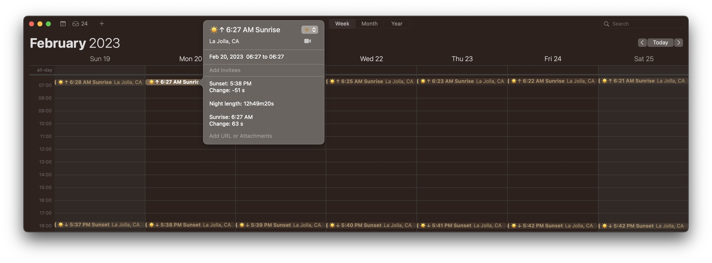

# suntimes\_ics



Generate an ICS calendar with Sunrise and Sunset times. WIP, but
functional.

## Usage

It doesn't support command line args yet (lol), so you have to change
the values of the constants at the top of `main.go`, and run using

``` bash
go run main.go
```

This will output an ICS file in the `output` directory, which you can
open in a Calendar app.
